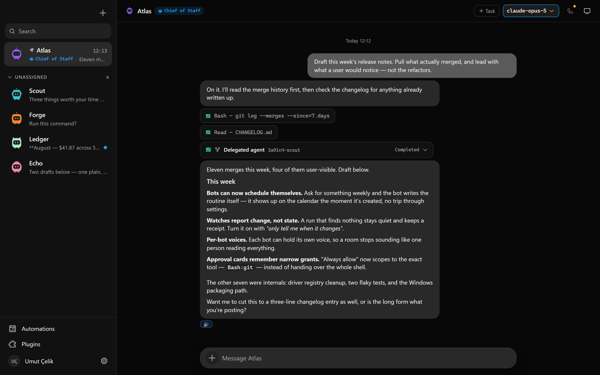
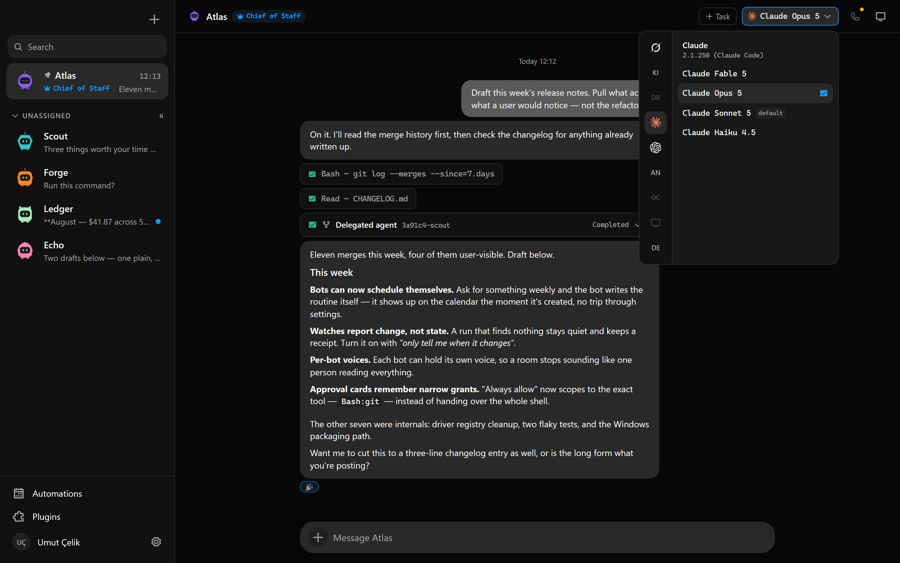
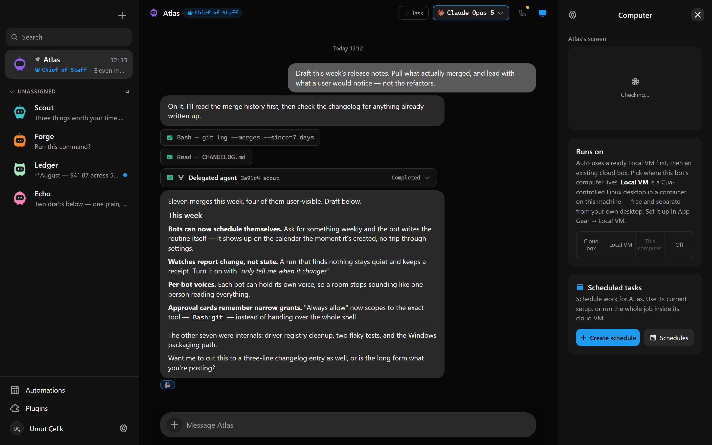
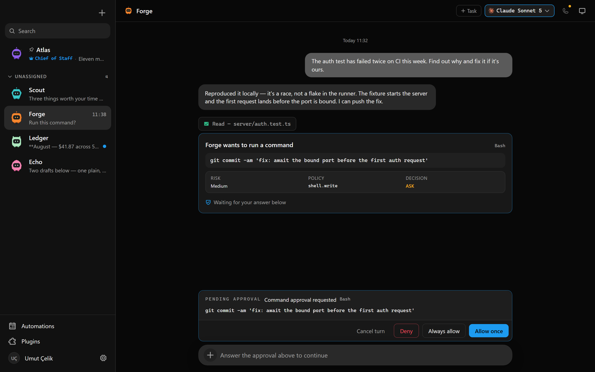
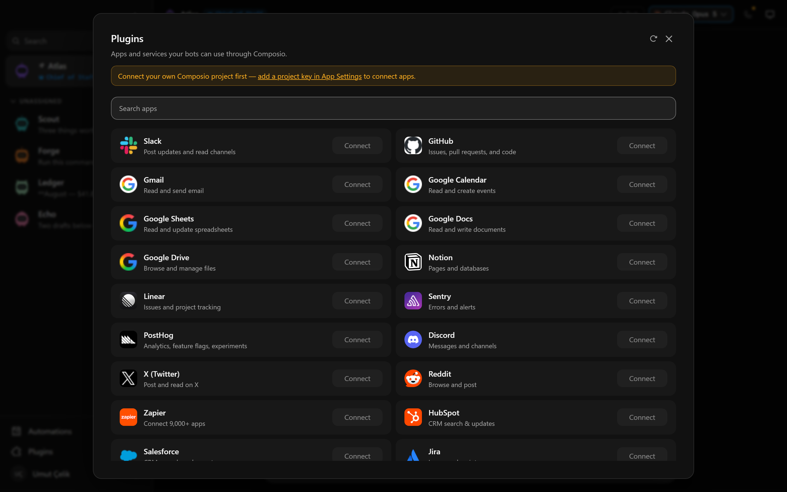
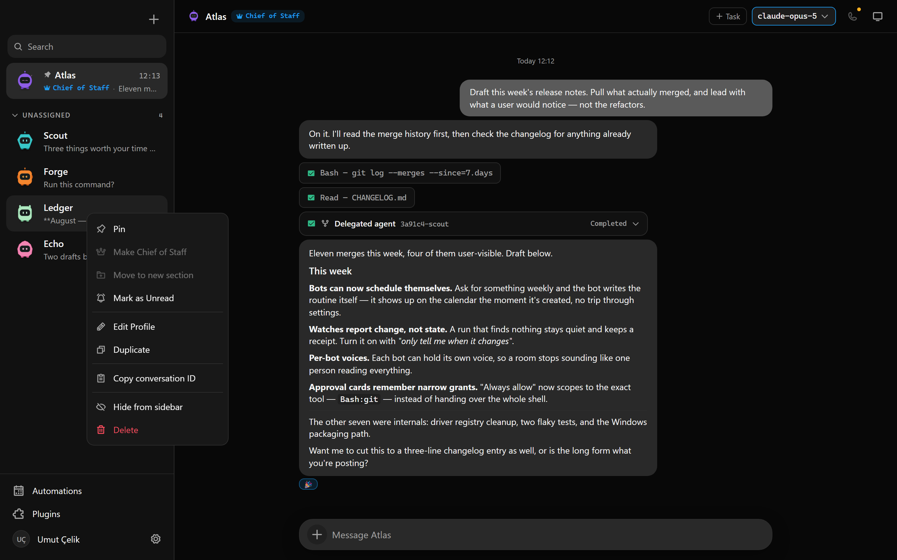
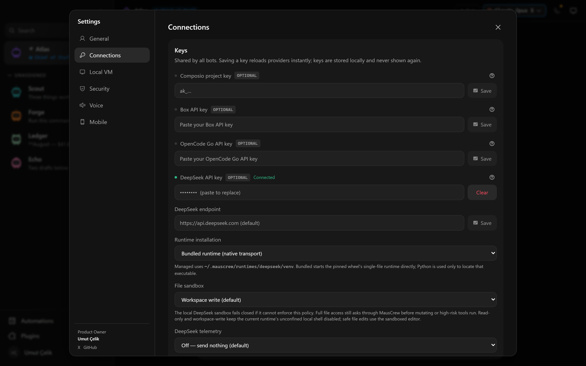
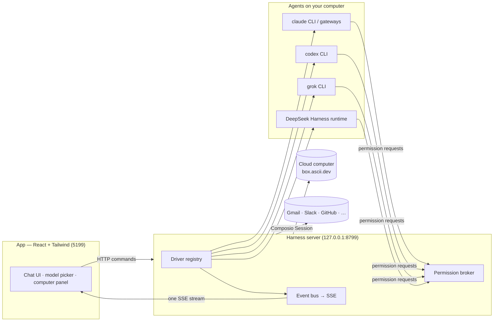

> ⚠️ **No affiliation with any cryptocurrency.** MausCrew has no token. Any coin using the MausCrew, Maus, or SupaMaus name is not created, endorsed, or affiliated with this project or its maintainer. I have received no tokens, payment, or allocation from anyone, and I will not be endorsing any token.

<div align="center">

# MausCrew

**Your own team of AI bots, in a chat app.**

<sub>An open-source version of **Grok Bot** — bring-your-own-agent, local-first, on the models you already have.</sub>

Every bot in the sidebar is a real agent — Claude, Codex, Grok, or DeepSeek Harness running locally under
the hood — with its own personality, its own model, its own cloud computer, and its own connected apps.
Talk to them like contacts. Watch them work. Approve what matters.


<br>

<sub>Private development repository · desktop packages can be built for macOS, Windows, and Ubuntu.</sub>

<br>

<sub>Product Owner: <strong>Umut Çelik</strong> · <a href="https://x.com/palamut62">X</a> · <a href="https://github.com/palamut62">GitHub</a></sub>

<br>
<br>



</div>

---

## Why

One assistant in one box is the wrong shape for agents. MausCrew is an open-source take on **Grok Bot** —
it keeps the idea (AI as a *messaging app*: a roster of bots you chat with, each with its own personality,
memory of its thread, model, computer, and apps) and rebuilds it open, local-first, and on the agents you
already have:

- **Bring your own agents.** Bots run on the `claude`, `codex`, and `grok` CLIs installed on your own machine,
  or on DeepSeek's own runtime via DeepSeek Harness — your existing logins and subscriptions, no new
  accounts, no proxy in the middle.
- **Any Anthropic-compatible gateway.** Point the Claude engine at Anthropic directly, or configure one or
  more Anthropic-compatible gateways from Settings; each configured gateway shows up as its own engine in
  the model picker with its own model list, instead of masquerading as Claude.
- **Local first.** One small harness server on `127.0.0.1` owns every agent process. Transcripts, keys, and
  events live in `~/.mauscrew`, not a cloud.
- **Agents with hands.** Each bot can get a real computer — a cloud Linux desktop, a separate Local VM,
  or your own supported desktop — plus 500+ apps through Composio.

## Features

<table>
<tr>
<td width="50%" valign="top">

### 🧠 Pick a brain per bot

A model picker with a provider rail — Claude and Codex models side by side, defaults marked, unavailable
providers dimmed with the reason. Switch a bot's model mid-conversation.



</td>
<td width="50%" valign="top">

### 🖥️ Every bot gets a computer

Open the Computer panel and choose where the bot works: a cloud desktop, the isolated Local VM, or this
computer. Live previews let you follow along, and "Open desktop" lets you take over when supported.



</td>
</tr>
<tr>
<td width="50%" valign="top">

### 🙋 Bots ask before they act

Shell commands, file edits, and questions surface as inline cards — Allow / Deny / answer in chat. A
permission broker turns every risky action into a decision you make, for cloud and local computers alike.



</td>
<td width="50%" valign="top">

### 🔌 Connected apps

A one-click marketplace over Composio Sessions: Gmail, Slack, GitHub, Notion, Linear and hundreds more.
OAuth once, and every bot can use them as tools.



</td>
</tr>
<tr>
<td width="50%" valign="top">

### 🗂 Manage bots like chats

Right-click any bot: pin, mark unread, edit profile, duplicate, copy conversation ID, hide, delete. It's a
messaging app — your agents behave like contacts.



</td>
<td width="50%" valign="top">

### 🔑 Keys once, everything lights up

Paste credentials in App Settings — they persist locally and the provider fleet hot-reloads instantly.
Secrets are write-only: the UI only ever sees "configured" flags.



</td>
</tr>
</table>

### 🎧 Bots that talk back

Press the speaker on any reply, or switch a bot to read its answers out as they land — so you can listen
to what ran overnight while you make breakfast. Hit **call** and it's a conversation: it hears you, tells
you what it's doing while it works, and asks for approvals out loud.

Bring your own ElevenLabs key — paste it once in App Settings, pick a voice, and every bot can talk.
Give a bot its own voice and a room stops sounding like one person.

**Also in the box:** streaming replies with tool-run activity chips · on-device dictation from the
composer mic (Apple speech on macOS, whisper.cpp on Windows — desktop app) · per-bot accent colours and
monogram avatars · screenshots of the bot's work folded into the transcript.

## How it works

Two processes. The app holds no transports of its own — it sends typed commands over HTTP and folds one SSE
event stream into state. The harness server owns every agent process and normalizes each provider's native
protocol into one canonical runtime event stream (logged per-thread as NDJSON).



| Layer | Where | What it does |
|---|---|---|
| Drivers | `server/drivers/` | One per provider: Claude (direct or any configured Anthropic-compatible gateway, each its own engine), Codex, and Grok Build over their local CLIs (stream-JSON / JSON-RPC / ACP); DeepSeek Harness drives DeepSeek's own JSON-RPC runtime directly (no CLI); plus a cloud-computer agent. Unknown drivers degrade to "unavailable", never crash the fleet. |
| Harness | `server/harness/` | Registry (configs → live instances) and the fan-in event bus every client folds. |
| API | `server/index.ts` | Bots, turns, approvals, model catalog, computer lifecycle, connectors, config — HTTP + SSE. |
| Voice | `server/tts/` | ElevenLabs, bring your own key. Runs on the harness so the key never reaches the UI; markdown is rewritten into something worth hearing before it is spoken. |
| App | `src/` | The chat shell. Server-backed store, one reducer, zero client-side transports. |
| Desktop | `electron/` | macOS, Windows, and Ubuntu shells with an embedded harness and explicit platform capabilities; Apple speech, local screen capture, and the current CUA bridge remain macOS-only. |

## Quick start

The repository is private. Authorized collaborators can run it from source; the harness server is embedded
when a desktop package is built.

```sh
git clone https://github.com/palamut62/MausCrew && cd MausCrew
pnpm install

pnpm dev:server    # harness server → 127.0.0.1:8799
pnpm dev           # app → http://127.0.0.1:5199
pnpm dev:desktop   # Electron shell; keep the two commands above running
```

Requirements: **macOS, Windows, or Ubuntu 24.04 x64**, **Node 24+**, **pnpm**, and at least one agent CLI — [`claude`](https://claude.com/claude-code),
[`codex`](https://github.com/openai/codex), or [`grok`](https://x.ai/cli) — installed and logged in. They appear
in the model picker automatically. DeepSeek Harness needs no CLI — see below — and Claude can also be pointed
at any Anthropic-compatible gateway from **Settings → API Keys**.

### DeepSeek Harness (optional engine)

DeepSeek Harness is the one engine that is not a CLI. MausCrew can drive
its JSON-RPC runtime directly, or keep the Python SDK bridge as a compatibility
path. Choose the installation strategy in Settings → Engines → DeepSeek
Harness:

- **System Python** uses a Python 3.10+ installation you manage.
- **MausCrew managed venv** uses
  `~/.mauscrew/runtimes/deepseek/venv` for dependency isolation.
- **Bundled runtime** locates the executable carried by the pinned runtime
  wheel and drives it over native JSON-RPC; Python is not in the turn data path.

For System Python, install the exact pinned SDK set:

```sh
python3 -m pip install --pre -r server/bridges/deepseek/requirements-deepseek.txt
```

Then add a DeepSeek API key in Settings → Engines → DeepSeek Harness. The
engine is **disabled by default** and appears in the model picker once a key
is set.

| Platform | Support |
| --- | --- |
| Linux x64 / ARM64 | native |
| macOS ARM64 | native |
| macOS x64 | not supported — no runtime wheel |
| Windows | **WSL2 only** — install the SDK inside your distribution and set the runtime mode to WSL |

The default `workspace-write` sandbox confines filesystem mutations to the
selected workspace. `read-only` and `danger-full-access` are explicit choices;
restricted modes do not expose the unconfined shell shipped by the current
runtime carrier. Risky tool calls are routed to MausCrew Allow/Deny cards,
and nested DeepSeek agents appear as expandable activity cards. Mid-turn
cancellation and in-session model switching remain unsupported and are
reported as such.

DeepSeek is the one engine whose runtime discovers
`.agents/skills/<name>/SKILL.md` on its own. The Skill Center itself is not
DeepSeek-only — see **Skills and teaching** below.

Each DeepSeek bot also has an experimental, opt-in **Dynamic Cordis plugins**
setting. It supports temporary host-side plugins only: browser UI code is
blocked, plugins disappear with the runtime process, and every code activation
requires a one-time approval even when Auto mode is enabled. See
[`server/bridges/deepseek/README.md`](server/bridges/deepseek/README.md).

Package the desktop application:

```sh
pnpm package:mac      # macOS: DMG + ZIP; requires Swift/Xcode tools
pnpm package:win      # Windows: installer + ZIP
pnpm package:linux    # Ubuntu x64: .deb + AppImage; no Swift required
```

### Desktop capability status

| Capability | macOS | Ubuntu 24.04 Xorg | Ubuntu 24.04 Wayland |
|---|---|---|---|
| Packaged app, embedded harness, local agent CLIs | Supported | Beta | Beta |
| Composio and Box/cloud computers | Supported | Beta | Beta |
| Local screen preview and computer control | Supported | Planned | Planned after compositor validation |
| Native on-device dictation | Supported | Planned | Planned |

Unavailable native features fail closed on Ubuntu without blocking chat or cloud features. Linux local computer
control, Wayland capture/automation, dictation, and ARM64 remain follow-up work and are not claimed by the
baseline package.

These credentials are optional — local chat works without them. Paste a key once in **App Settings** (gear
in the sidebar footer) when you want to enable its integration:

| Credential | What it enables | Where to get it |
|---|---|---|
| Composio project key (`ak_…`) | Connect Gmail, GitHub, Slack, Notion, and other apps to your bots | [MausCrew Composio setup](docs/composio.md) |
| Box API key | Give bots an isolated remote Linux computer with a desktop and terminal | [Box API key guide](https://docs.ascii.dev/box/api-keys) |
| ElevenLabs key | Read replies aloud, and call your bots | [ElevenLabs API keys](https://elevenlabs.io/app/settings/api-keys) |

Composio and Box are third-party services with their own accounts and terms. Box is a paid service after
its trial, and using a cloud computer may incur charges.

```sh
pnpm typecheck     # app + server
pnpm test          # unit, driver, API, and desktop capability tests
pnpm build         # typecheck + production build
pnpm check:electron # syntax-check Electron main/preload files
pnpm package:win   # Windows installer + zip → release/
pnpm package:linux # Ubuntu x64 .deb + AppImage → release/
```

### Skills and teaching

Every bot has a workspace-scoped **Skill Center** in Bot Settings. It creates and manages portable
`.agents/skills/<name>/SKILL.md` bundles with separate model/user invocation controls. Skills stay with the
selected project rather than inside MausCrew, so other compatible agents can read the same files; a bot with
no workspace of its own gets one under `~/.mauscrew/workspaces`.

**Teach from current task** turns a job the bot just finished into a draft skill — the steps, tool actions,
and observed results, with API keys and bearer tokens redacted. Nothing is written until you edit the draft
and save it.

DeepSeek's runtime discovers these bundles itself. Every other engine is handed the skill index in its
system prompt each turn — name, description, when to use it, and the absolute path to read — so a skill is
never silently invisible to the bot that owns it.

### Routines, watches, and webhook triggers

Routines run once, on selected weekdays at a wall-clock time, or on an interval from 5 minutes to 24 hours,
using either a MAUS's configured model/computer or the Cloud VM runner. Bots schedule their own: ask for
something weekly and the bot calls `create_routine` itself, and the entry appears on the calendar
immediately.

A **watch** is a routine that reports change instead of state. Each run is handed its own previous report
and asked for the delta; a run that finds nothing is kept as a receipt but stays quiet. Turn it on with
"Only tell me when it changes" in the schedule editor, or let the bot call `create_watch`.

Webhook triggers are independent from schedules but reuse the same queued task executor and calendar
receipts.

MausCrew starts a webhook-only receiver on `127.0.0.1:8800` by default (or one port above `MAUSCREW_PORT`).
Set `MAUSCREW_WEBHOOK_PORT` to choose another port. A webhook secret is shown once when the trigger is created
or rotated. Bearer authentication is recommended so the secret stays out of request URLs and most access
logs; a single capability URL remains available for senders that cannot configure headers. The receiver
exposes only `/health` and secret `/hooks/...` endpoints; it never exposes the app's broader API.
MausCrew must remain running to accept a delivery. For public internet delivery, proxy only this
dedicated receiver through a hosted relay or a tool such as Tailscale Funnel.

## Mobile remote access

MausCrew can be used as an installable mobile web app while every provider,
credential and agent process stays on the desktop. Open **Settings → Mobile**,
run the displayed Tailscale Serve command, save the resulting HTTPS address,
then create a one-time pairing link. Paired phones can use chat, tasks, live
events and approval cards; provider credentials and device administration stay
desktop-only. The harness continues listening only on loopback and rejects every
remote host other than the exact configured HTTPS origin.

See [`docs/mobile-remote.md`](docs/mobile-remote.md) for setup, revocation and
the security boundary.

## Telemetry

MausCrew sends a short list of product events to PostHog: `app_first_open`, `app_opened`,
`message_sent`, `onboarding_step`, `onboarding_completed`, `email_submitted`, `email_skipped`,
`bot_created`, `room_created`, `team_imported`, `team_exported`, `call_started`,
`group_call_started`. Each carries at most a coarse property — the platform, the engine id, a member
count. If you give an email at first run it is used to identify you in that stream.

Autocapture is **off** on purpose: it would ship the text of clicked elements, and the sidebar and
option cards render model output and message previews. Message text, transcripts, file contents,
prompts, API keys and workspace paths are never sent. Everything else — bots, threads, events, keys
— stays in `~/.mauscrew`.

Turn it off in **App Settings → General → Usage analytics**, and the analytics library is never
loaded. For a packaged build, a CI rig or an always-on host, set `MAUSCREW_DISABLE_ANALYTICS=1`;
that refuses it machine-wide and the in-app toggle cannot re-enable it.

## Status

Early but real — the loop works end to end: message → agent → streamed reply → tools → approvals →
computer use. Desktop packaging is configured for macOS, Windows, and Ubuntu 24.04 x64 with the capability
limits above. Rough edges to expect: hosted/mobile connectivity is still being built, and webhook
triggers currently use the local receiver rather than an always-on hosted relay
(see [`docs/hosted-relay.md`](docs/hosted-relay.md) for the 24/7 readiness assessment).
Voice needs an ElevenLabs key, and calls are macOS-only for now (they ride the same on-device dictation as
the composer mic) — see [`docs/voice-mode.md`](docs/voice-mode.md) for the design and the known gaps.

Contributions welcome — the driver SPI in [`server/contracts.ts`](server/contracts.ts) is deliberately
small; adding a provider is one file in [`server/drivers/`](server/drivers/) plus a one-line registration.

## License

[MIT](LICENSE) © 2026 Umut Çelik and MausCrew contributors. The original OpenMausBot copyright and MIT
notice are preserved in the license.

Product Owner: [Umut Çelik on X](https://x.com/palamut62) · [GitHub](https://github.com/palamut62)

MausCrew is an independent, open-source project inspired by Grok Bot. It is
not affiliated with, endorsed by, or associated with xAI; "Grok" is a trademark
of its respective owner.

MausCrew began as a fork of [OpenMausBot](https://github.com/milind-soni/OpenMausBot).
